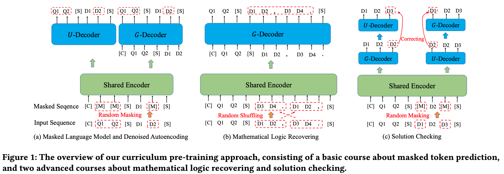

# JiuZhang
This is the official PyTorch implementation for the [paper](https://arxiv.org/abs/2206.06315):

> JiuZhang: A Chinese Pre-trained Language Model for Mathematical Problem Understanding

## Overview

We propose JiuZhang, which is developed based on the Transformer architecture, consisting  of a shared Transformer encoder, a decoder for the understanding tasks ($U$-decoder) and a decoder for the generation tasks ($G$-decoder). And we design a curriculum pre-training approach to improving the understanding of mathematical knowledge and logic, from basic to advanced courses.



## Requirements

```
torch==1.10.0
transformers==4.10.0
datasets==1.11.0
jieba
```

## Dataset

Datasets cannot be shared temporarily for some commercial reasons.

## Curriculum Pre-Training

### Base Model
Please download the initial model from https://huggingface.co/fnlp/cpt-base.

### Scripts
We put the training scripts of the three courses in stage 1, 2 and 3 respectively. You can run pre-training with single GPU by:
```bash
bash scripts/stage_1/2/3.sh
```
or run distributed data paralle pre-training with multiple GPUs by:
```bash
bash scripts/stage_1/2/3_ddp.sh
```

### Arguments
You can check more details about training arguments in the [official docs](https://huggingface.co/transformers/v4.10.0/main_classes/trainer.html#trainingarguments) of huggingface. We explain some special arguments here.
- **model_name_or_path** - Directory of model checkpoint for weights initialization. Put your downloaded base model here.
- **data_path** - Your pre-processed training data saved in Dataset format. We save the problem statement and answer process in the 'content' and 'analysis' keys.
- **add_token_path** - There may be some important words in your corpus that cannot be correctly split by the tokenizer of the pre-trained model, such as mathematical symbols. You can add them to the vocab by this argument and train the embedding from scratch.

## Citation

Please consider citing our paper if you use our codes.

```bibtex
@inproceedings{zhao2022jiuzhang,
  title={JiuZhang: A Chinese Pre-trained Language Model for Mathematical Problem Understanding},
  author={Zhao, Wayne Xin and Zhou, Kun and Gong, Zheng and Zhang, Beichen and Zhou, Yuanhang and Sha, Jing and Chen, Zhigang and Wang, Shijin and Liu, Cong and Wen, Ji-Rong},
  booktitle={Proceedings of the 28th ACM SIGKDD Conference on Knowledge Discovery and Data Mining},
  pages={4571--4581},
  year={2022}
}
```